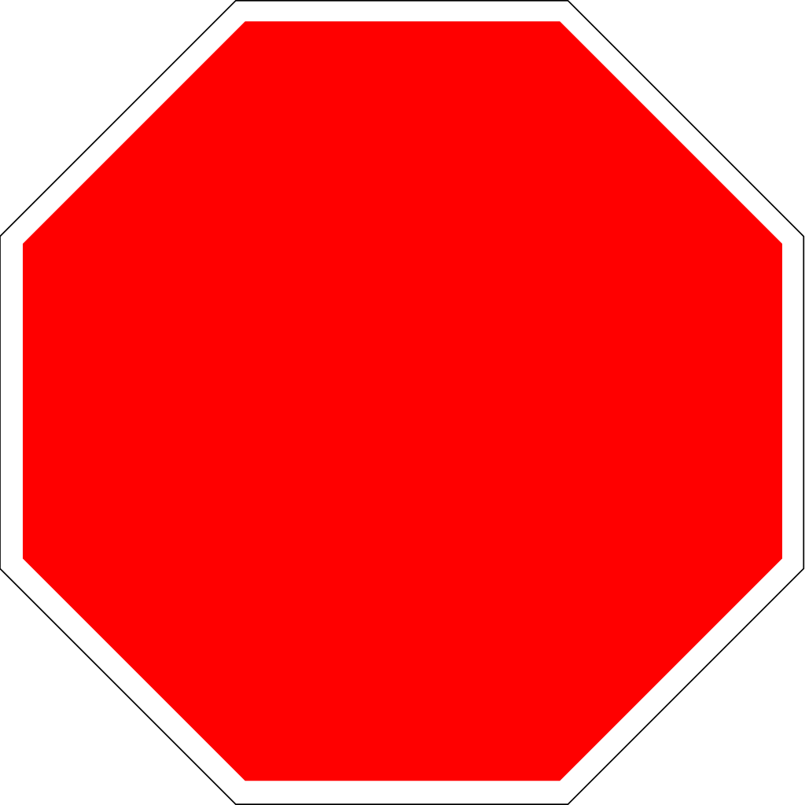

	
	
	
	
	
	
	

Coding standards are a general necessity to every programmers life whether your a beginner
or a life long software developer. Obviously, a beginner would have fairly poor standards 
at first, but is not just about spacing and indentations. Coding standards may also
restrict you from using things like the three parts in a for loop rather than just using
for in method when possible. Our standards specify both and go further as you will see
later on.

As a fairly beginner programmer my coding standards follow fairly low standards with
simple spacing organization and certain styles like for loops more often than not. 
However, as we begin to move towards more advanced level of programming, the standards
also increase and our Professor expects more from us. By actually getting stricter on his
standards, he forces us to learn new coding styles in order to promote speed and
simplicity to our programming. 

Enter the <strong>Code Nazi</strong>. ESLint is programming grammar nazi who basically 
restricts the free world you once knew, into a very specific communist format. It is able
to do this through the program IntelliJ which allows you to implement specific flag types
of your choice. Apparently, ESLint is the one we like <em>*cough my professor likes</em>
where one of the very specific things it does is restrict for loops and notifies you when all
the for loops are gone. The reason we are likely forced to not have loops is because we 
are trying to learn a new segment in programming called functional programming, utilizing
the underscore library to negate the need to use any if statements or loops.

	
The Code Nazi notifies you when everything is okay through a green check mark. I have
found myself dreading to see if there is a green check in corner or not. However, as 
strict as it is, ESLint isn't trying to kill us but allowing us to practice on 
diversifying our programming knowledge base. Although I do find some of its spacing issues
quite excessive, I do feel a sense of beauty in the masterpiece which ESLint has forced 
us to sculpt. 	

In my personal opinion, coding standards are something you should consider implementing. 
Making it even stricter makes large blocks of code very easy to follow for anyone. For 
someone as bad as me, having good coding standards makes it easy for someone to follow 
along with my code and help solve my issues. Standards are always a love hate relationship
don't know how much you love them, until you wish you had them again.

