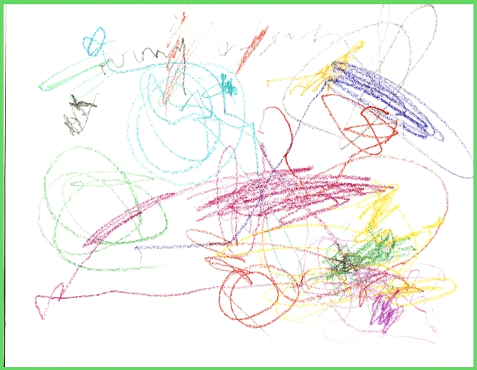

<link href="https://fonts.googleapis.com/css?family=Dancing+Script" rel="stylesheet">

<body>

	

Remember back to your younger days, still in grade school and its art time. And this
being your first time, you pull out all your crayons and color to your hearts content. 
You draw the most beautiful, amazingly epic drawing that you've ever laid witness to.
Now finished you're about to share with cute little Tatiana and you realize Jason with the 
nice shoes and nice hair and nice... actually drew your first visual understanding of what
it meant for something to be sexy, next to Tati of course. And then you reflect. All you 
really did was create several dozen never before seen shapes that not even your best 
friend Brett would appreciate. <i> There goes Tati and Jason into the sunset as they 
make use of my drawing to wrap their now tasteless gum.</i>

Just like little old you, we all know how to do a basic UI design using html and css. Even
those who don't, can very quickly pick up the basics through many of the free and easy 
online coding courses. But once you finish you'll quickly realize one of the issues of 
the vanilla version, is that it's quite difficult to make it really how you want it. 
Luckily, much like this font, your development process can greatly improve. Whether
it is the immense time it takes to format things properly or the appeal factor that one
initially looks for when first visiting a web page, these are all addressed when using a 
UI Framework.

For my ICS 314 we began dipping into Semantic UI as our choice of UI Frameworks. With this 
new tool at our disposal, we are able to move beyond that simplistic style of html pages
and become capable of producing appealing and attractive web pages. UI Frameworks allow us
to move from <a href="..//images/sexy-boring.png">Boring things</a> to <a href="..//images/sexy-sexy.png">Sexy things</a> with efficiency
at a few hours worth of upfront cost. Although difficult at first, you find out that you 
can quickly pick up how logically formatted this Framework is. Our choice with Semantic UI
was likely due to the logical format of which Semantic UI tries to use when defining 
elements and variations. It may not have everything yet, but as it grows it becomes easier 
to make things like a footer background segment that has several columns with lists, 
links, forms and more with easily adjustable formatting if you want to make your own 
variations by adding those alterations via css.

Next time you decide to make a webpage I suggest moving past HTML. Move beyond the basics
with css. Transcend into a UI Framework and be Jason and take Tatiana. Make it Sexy.

</body>